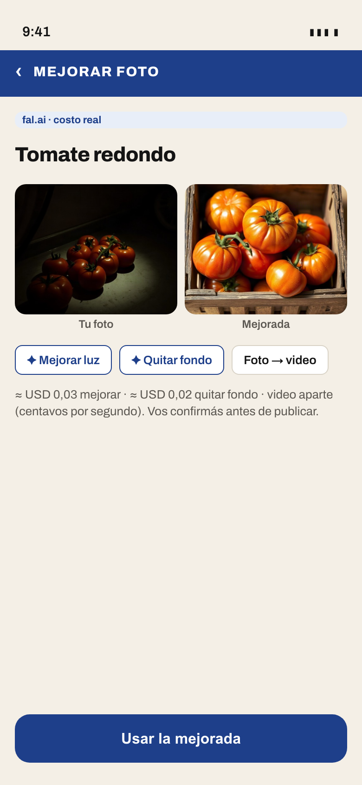
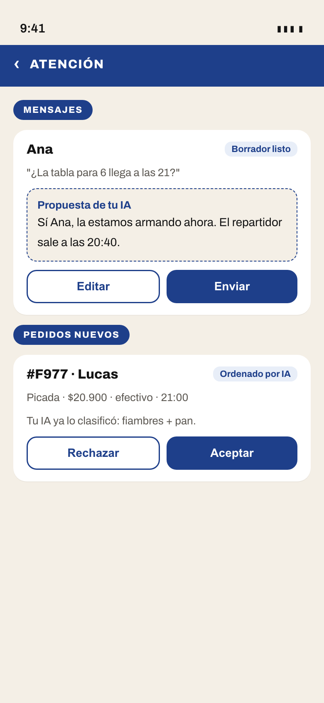
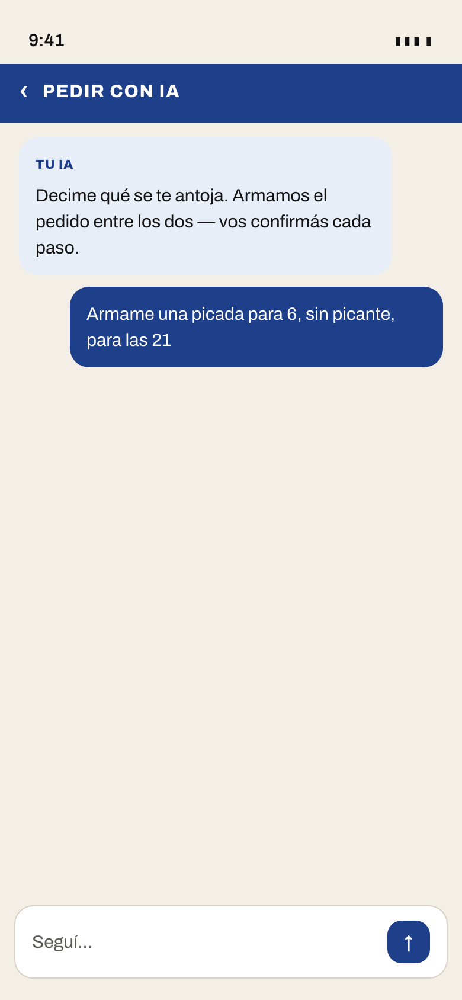
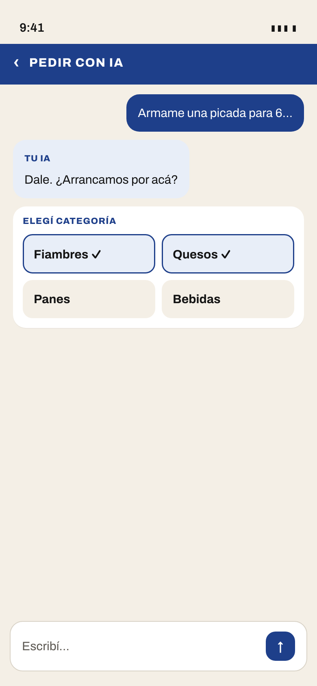
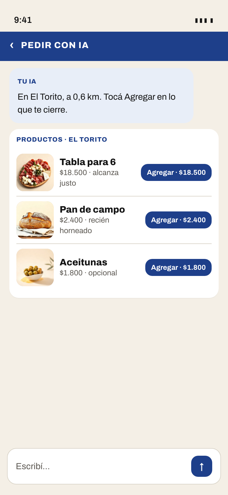
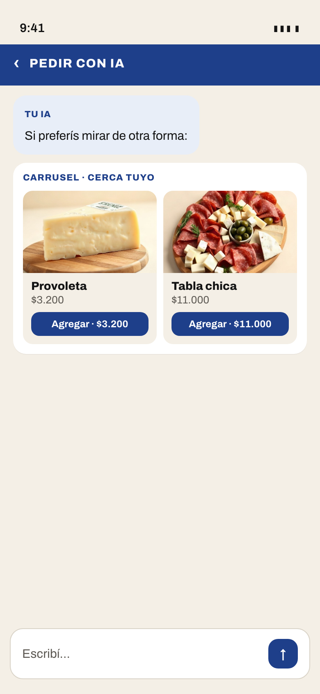
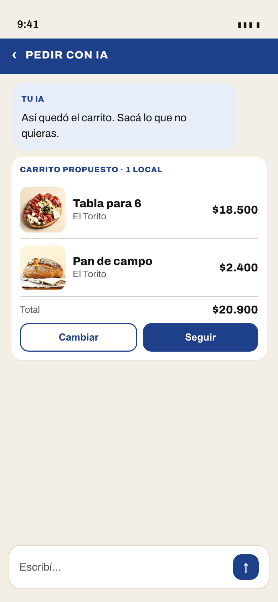
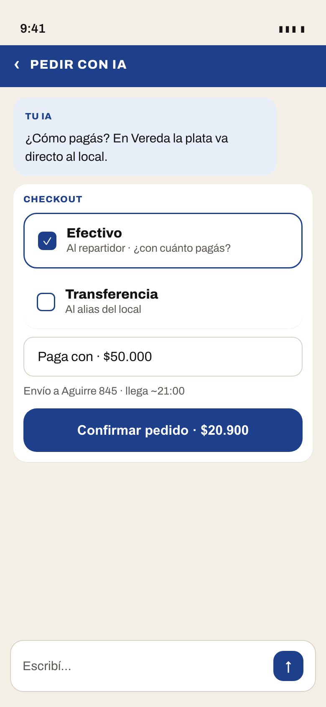
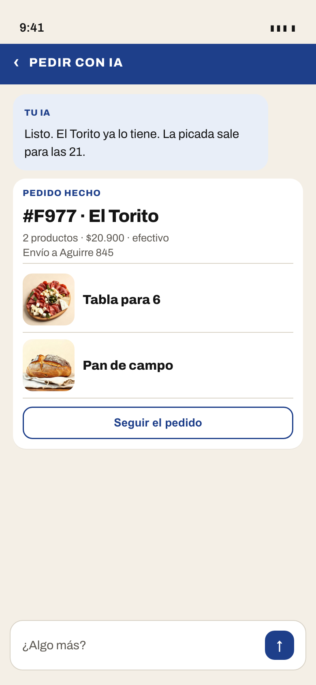

# Propuestas del módulo IA — ronda con Leo

Nada de esto entra al lanzamiento del 28: capacidad `ia` + adaptadores del nodo **apagados**; pantallas después del OK, hacia una 1.1.

Decisiones de producto ya cerradas: cobro = costo real sin margen; traer tu propio agente gratis siempre; IA propone y la persona confirma; barrio sin IA = app sin nada nuevo; gateway de texto intercambiable (OpenRouter default + Vercel); medios de imagen/video vía **fal.ai** (intercambiable como el gateway), costo real por uso.

---

## Qué tiene que mirar Leo en esta ronda

**Los mockups del chat con widgets** (secuencia `chat-01`…`chat-07` + `comercio-atencion` y `comercio-foto-fal`).

¿Sí tal cual, o querés cambios? (una sola pregunta)

---

## 0. Decidido por Leo (2026-09-26)

### Compradores
1. **Pedir con IA = chat completo con widgets tipados** (no un chat común): categorías, tarjetas de producto con foto y “Agregar · $X”, grilla/carrusel, carrito, checkout, recomendaciones. UI generativa: el agente devuelve widgets; la app los dibuja con componentes Vereda.
2. **Búsqueda inteligente: sí.**
3. **Repetir / sugerencias: sí.**

### Comercios (lo que se vende)
1. **Fotos y video con IA vía fal.ai**: mejorar fotos, quitar fondo, foto → video, etc. Proveedor de medios intercambiable; costo real medido en el extracto.
2. **Mejorar textos** (nombres, descripciones, copy del local).
3. **Atención al cliente + recepción de pedidos** (responde mensajes/reseñas, recibe y ordena pedidos; la persona confirma).

### Sin cambios
- **Tu IA** (activar, tope, consumo): opción A.
- **Gateway de texto:** OpenRouter por defecto + Vercel listo.
- **Descartado por ahora:** resumen del día (y el chat genérico sin widgets).

---

## 1. La capacidad, en criollo

El operador del barrio prende o apaga la IA (apagada por default). Quien la quiere la activa solo, con tope mensual en USD. Se mide lo que costó cada uso (texto y medios). Pagás al operador del barrio por transferencia, como un aporte: **no es comisión, es lo que costó el modelo / fal**. Si llegás al tope, se pausa. Traer tu propio agente sigue gratis siempre.

---

## 2. Superficies decididas

### Comercio

**(a) Fotos y video (fal.ai)** — mejorar luz, quitar fondo, foto → video. La persona confirma antes de publicar.

**(b) Mejorar textos** — nombres, descripciones y copy del local: propuesta en la pantalla de editar (misma idea que antes: “Usar esta descripción”).

**(c) Atención + recepción de pedidos** — borradores de mensajes/reseñas y pedidos nuevos ordenados por la IA; Aceptar / Editar / Enviar.

### Comprador

**(d) Pedir con IA (chat + widgets)** — ver §3 abajo (benchmark + propuesta + secuencia).

**(e) Búsqueda inteligente** — la búsqueda entiende lenguaje natural (“algo fresco para la cena”).

**(f) Repetir / sugerir** — “¿Lo de siempre?” y sugerencias en el inicio.

---

## 3. Pedir con IA — chat con widgets

### 3.1 Benchmark (leído 2026-09-26)

| App | Qué hace | Widgets / confirmación | Bien / mal |
| --- | --- | --- | --- |
| **Instacart · Clementine / Cart Assistant** ([press](https://company.instacart.com/pressreleases/meet-clementine-instacart-s-ai-shopping-assistant-that-takes-what-s-for-dinner-off-your-plate), [help](https://www.instacart.com/help/section/809794019/603436865)) | Charla → recetas / lista → carrito en el retailer | Productos sugeridos, “add to cart”, foto de lista | Bien: agente adentro del flujo de compra. Mal: vive en marketplace grande; confirmación a veces opaca. |
| **Amazon Rufus / Alexa for Shopping** ([aboutamazon](https://www.aboutamazon.com/news/retail/amazon-rufus)) | Preguntas en la barra / PDP; compara y recomienda | Chips de follow-up, respuestas con productos | Bien: contexto del catálogo. Mal: chat lateral, no es el checkout entero; ads. |
| **Klarna** ([ChatGPT Shopping Search](https://investors.klarna.com/News--Events/news/news-details/2026/Klarna-launches-AI-powered-Shopping-Search-app-in-ChatGPT/default.aspx)) | Descubrimiento multi-comercio en la conversación | Resultados visuales con precio; checkout en el merchant | Bien: visual en el chat. Mal: te saca de la conversación para pagar. |
| **DoorDash / Uber Eats / Rappi** | Asistentes / “reorder” / búsqueda NL (varía por mercado) | Menos “UI generativa”; más atajos a menú | Bien: reorden y búsqueda. Mal: pocos widgets tipados; poco efectivo P2P. |
| **Mercado Libre** | Asistente y recomendaciones en app | Tarjetas de ítem, preguntas | Bien: catálogo enorme. Mal: no es pedido de barrio ni efectivo al repartidor. |

**Aprendizaje para Vereda:** el chat tiene que **ser** el flujo (categoría → producto → carrito → checkout), no un lateralesito. Widgets tipados + confirmación humana en cada paso. Diferencial: efectivo / transferencia P2P, copy de barrio, sin comisión.

### 3.2 Propuesta Vereda — catálogo de widgets

El agente no pinta HTML libre: devuelve **widgets tipados**; la app los renderiza con VeredaUI.

| Widget | Qué muestra | Acción de la persona |
| --- | --- | --- |
| `elegir_categoria` | Chips / tarjetas de rubro | Tilde qué entra |
| `tarjeta_producto` | Foto, nombre, precio, local | **Agregar · $X** |
| `grilla_productos` | 2 columnas / carrusel | Agregar uno a uno |
| `carrito` | Ítems + total | Cambiar / Seguir |
| `checkout` | Efectivo (paga_con) o transferencia | Confirmar pedido |
| `recomendacion` | “Te puede gustar” | Agregar / Ignorar |
| `local` | Ficha corta del comercio | Elegir / Ver |

Si el barrio no ofrece `ia`, **la app no muestra Pedir con IA ni ningún widget**.

### 3.3 Conversación de punta a punta (mockups)

“Armame una picada para 6…” → categorías → productos con foto → grilla opcional → carrito → checkout en efectivo → pedido hecho.

Fotos de producto generadas con **fal.ai / flux/schnell** (2026-09-26), gasto de mockups ≪ USD 1.

---

## 4. Pantalla “Tu IA”

Sigue la **opción A**: activar, consumo del mes, tope, cómo se paga.

Montos del mockup alineados al §5: **USD 0,11 de un tope USD 2** (≈ $170 / ≈ $3.100) — comercio activo ~USD 0,09/mes en texto.

Copy: *“No es comisión: es lo que cuesta el modelo.”* / *“casi gratis: pagás lo que gasta el modelo.”*

---

## 5. Modelos, fal.ai y costo estimado

Precios OpenRouter `/api/v1/models` y fal Platform API `/models/pricing` el **2026-09-26**. Blue venta ≈ **ARS 1.560**.

### Texto (igual que antes; gateway OpenRouter / Vercel)

| Función | Modelo | ≈ USD / uso |
| --- | --- | ---: |
| Pedir con IA (turno con widgets) | `google/gemini-2.5-flash` | 0,0012 |
| Búsqueda / sugerir / textos | `google/gemini-2.5-flash-lite` | 0,0001–0,0002 |
| Responder mensaje/reseña | `google/gemini-2.5-flash-lite` | 0,00014 |

Comercio activo (texto) ~**USD 0,09/mes**. Comprador ocasional ~**USD 0,014/mes**.

### Medios fal.ai (recomendados)

| Uso | Endpoint fal | Precio (2026-09-26) | ≈ USD / uso típico |
| --- | --- | --- | ---: |
| Mejorar / generar foto de catálogo | `fal-ai/flux/schnell` | USD 0,003 / MP | **0,003** (≈1 MP) |
| Mejorar calidad (upscale) | `fal-ai/clarity-upscaler` | USD 0,03 / MP | **0,03** |
| Quitar fondo | `fal-ai/bria/background/remove` | USD 0,018 / generación | **0,018** |
| Quitar fondo (barato) | `fal-ai/imageutils/rembg` | USD 0,000625 / s compute | **~0,002–0,01** |
| Foto → video (piloto) | `fal-ai/kling-video/v1/standard/image-to-video` | USD 0,045 / s | **0,23** (5 s) |
| Foto → video (alt.) | `fal-ai/wan/v2.2-a14b/image-to-video` | USD 0,08 / s | **0,40** (5 s) |

### Volumen comercio activo (mes) — supuestos

| Uso | Cantidad | ≈ USD |
| --- | ---: | ---: |
| Mejorar / generar 40 fotos (schnell) | 40 | 0,12 |
| Quitar fondo 20 (bria) | 20 | 0,36 |
| 4 clips foto→video 5 s (kling) | 4 | 0,90 |
| Textos (arriba) | — | 0,09 |
| **Total comercio con medios** | | **~1,5** |

Sin video, solo fotos+fondo: ~**USD 0,6/mes**. El video es lo que sube; conviene tope aparte o “video solo si lo pedís”.

---

## 6. OpenRouter vs Vercel AI Gateway

El operador del barrio elige el gateway por config (`openrouter` | `vercel`). El nodo trae **dos adaptadores desde el día uno**; ninguno hardcodeado. Fuentes leídas el **2026-09-26**: [Vercel AI Gateway](https://vercel.com/docs/ai-gateway), [pricing](https://vercel.com/docs/ai-gateway/pricing), [budgets](https://vercel.com/docs/ai-gateway/observability-and-spend/budgets), [usage/generation lookup](https://vercel.com/docs/ai-gateway/observability-and-spend/usage), [OpenRouter docs](https://openrouter.ai/docs) ([API keys](https://openrouter.ai/docs/api-keys), [FAQ / fees](https://openrouter.ai/docs/faq), [create keys](https://openrouter.ai/docs/api/api-reference/api-keys/create-keys), [get generation](https://openrouter.ai/docs/api/api-reference/generations/get-generation)), [Vercel for Startups credits](https://vercel.com/startups/credits).

### Comparación

| | **OpenRouter** | **Vercel AI Gateway** |
| --- | --- | --- |
| **Costo / markup sobre el proveedor** | Sin markup en la inferencia: pasa el precio de lista del proveedor. Al **comprar créditos** cobra **5,5% (mín. USD 0,80)** con tarjeta (Stripe); cripto **5%**. BYOK: sin fee hasta USD 25.000/mes de costo de lista (PAYG); arriba de eso, **5%** del costo OpenRouter equivalente. | Sin markup ni fee de plataforma sobre tokens: precio de lista del proveedor, también con BYOK. Tier free: **USD 5/mes** de créditos incluidos (subset de modelos + rate limits más bajos). Tier pago: comprás créditos. Pueden aplicar **fees de procesamiento de pago** (tarjeta); factura Enterprise = sin esos fees. Add-ons opcionales (reporting, allowlist/ZDR team-wide, traces) se cobran aparte. |
| **Topes por cuenta (sub-claves)** | **Sí, nativo.** Management API `POST /api/v1/keys` con `limit` (USD) y `limit_reset` (`daily` \| `weekly` \| `monthly` \| sin reset). Ideal para una sub-clave por identidad con tope mensual. | **Budgets** opcionales por team / project / **API key** / member, con refresh daily/weekly/monthly. Sin budget = spend ilimitado en esa clave. **No** hay provisioning de sub-claves con tope tan directo como OpenRouter: el nodo tiene que crear claves + budgets (o imponer el tope él mismo). |
| **Costo real por llamada** | `GET /api/v1/generation/{id}` → `total_cost`, `upstream_inference_cost`, tokens nativos. El `id` viene en la respuesta de chat. | `GET /v1/generation?id=…` (o SDK `gateway.getGenerationInfo`) → costo con desglose (`market_cost`, `surcharge_cost`, `gateway_cost`), tokens, latencia. El `id` viene en la respuesta (`id` / `providerMetadata.gateway.generationId`). Logs en el dashboard. |
| **Modelos de la tabla §4** | Todos con los ids de OpenRouter (catálogo `/api/v1/models`). | Verificados el 2026-09-26 en `https://ai-gateway.vercel.sh/v1/models`: `google/gemini-2.5-flash`, `google/gemini-2.5-flash-lite`, `openai/gpt-4o-mini`, `anthropic/claude-haiku-4.5` **sí**. Llama: `meta/llama-3.3-70b` (id distinto a `meta-llama/llama-3.3-70b-instruct`). Visión Qwen: familia `alibaba/qwen3-vl-…` (no el id exacto `qwen/qwen3-vl-30b-a3b-instruct`). El adaptador mapea ids por gateway. |
| **Créditos / programa startups** | No hay programa de financiamiento equivalente documentado; cargás créditos. | **Vercel for Startups**: hasta **USD 30.000** de Flexible Commitment (asientos, compute, **AI Gateway**, v0, etc.) por 1 año o hasta agotar. **Tope AI Gateway: 50%** del commitment (el resto no se puede volcar todo a IA). Elegibilidad: afiliación a un **Startup Partner** aprobado + prueba; Series A o menos; aplicar dentro de los 12 meses de la última ronda; web + email del dominio; sin créditos startups previos. Aplicación: [vercel.com/startups/credits](https://vercel.com/startups/credits) (formulario + team + partner + proof). Review ~5–7 días; al aceptar términos, créditos en ~5–7 días hábiles. Términos Flex Commit p/ aceptados desde **2026-08-06**. Sin partner en la lista: pedir al VC el [partner request](https://vercel.com/startups/partners) — Vereda bootstrapeada puede no calificar tal cual. |

### Recomendación (default)

**Arrancar con OpenRouter por defecto:** sub-claves con tope mensual nativas (encajan con “cada cuenta elige su tope”), lectura de costo por generación clara, sin depender de partner/créditos. **Vercel como segundo adaptador desde el día uno** — conviene prenderlo si Leo consigue el programa startups (hasta ~USD 15.000 útiles para AI Gateway vía el 50%) o si el operador del barrio ya opera en Vercel.

---

---

## 7. Qué llega el lunes 28 y qué no

| Llega el lunes | No llega el lunes |
| --- | --- |
| Spec de la capacidad `ia` (widgets tipados, medios fal, textos, atención) | Pantallas en builds de tienda |
| Adaptadores texto **OpenRouter + Vercel** y medios **fal.ai**, apagados por defecto | Deploy prod con IA prendida |
| Sin clave → el nodo como hoy | Piloto 5 comercios (después del OK visual) |
| | Créditos Vercel for Startups (Leo aplica si califica) |

Pantallas (chat con widgets, fal, atención) → **1.1** después del sí de Leo a esta ronda.

---

## Apéndice — descartado (2026-09-26)

- Resumen del día / qué reponer (opciones A/B/C viejas).
- Chat genérico sin widgets (opción C de “pedir en lenguaje natural”).
- Modo “búsqueda inteligente” como pantalla aparte del Buscar.
- Mockups viejos de esas opciones quedan en `mockups/` por si hace falta; no son la propuesta vigente.

---

## Cómo leer esto en el teléfono

1. Empezá por **Qué tiene que mirar Leo** y los PNG `chat-01`…`chat-07`.
2. Después comercio (`comercio-*`) y Tu IA.
3. Costos en §5; gateway en §6.
