# Propuestas del módulo IA — para decidir

Paquete para que Leo revise **antes** de construir pantallas. Nada de esto entra al lanzamiento del 28: el lunes llega la capacidad `ia` + el adaptador del nodo **apagados**; las pantallas van después del OK, hacia una 1.1.

Decisiones ya cerradas (no reabrir): cobro = costo real del modelo, sin margen; traer tu propio agente sigue gratis; el barrio (nodo) prende o apaga la oferta; la plata va P2P al operador del barrio, como un aporte; Vereda nunca toca plata; piloto con 5 comercios; el gateway del nodo es **intercambiable** (OpenRouter o Vercel AI Gateway por config, dos adaptadores desde el día uno).

---

## 0. Qué tenés que decidir

Una decisión por función. En cada una elegí **A, B o C**. La recomendación va marcada.

1. **Catálogo desde fotos** — ¿A (en la pantalla del catálogo), B (flujo con fotos + lista para confirmar) o C (chat)? → **recomiendo A+B**: A para entrar, B para confirmar.
2. **Descripción y precio sugeridos** — ¿A (en editar producto), B (hoja después de la foto) o C (pantalla “completar con IA”)? → **recomiendo A**.
3. **Responder mensajes y reseñas** — ¿A (borrador en la reseña), B (borradores en la bandeja) o C (chips al escribir)? → **recomiendo A**, con B si hay muchos pendientes.
4. **Resumen del día / qué reponer** — ¿A (tarjeta arriba de la bandeja), B (pantalla “Tu día”) o C (aviso al cerrar)? → **recomiendo A**; B como detalle.
5. **Pedir en lenguaje natural** — ¿A (campo en el inicio), B (pantalla “Armame un pedido”) o C (chat genérico)? → **recomiendo A+B**; **no C**.
6. **Búsqueda inteligente** — ¿A (la búsqueda entiende lo que escribís), B (resultado con “por qué”) o C (modo aparte)? → **recomiendo A**.
7. **Repetir / sugerir** — ¿A (tarjeta en el inicio), B (después de entregar) o C (pantalla “Para vos”)? → **recomiendo A**.
8. **Pantalla “Tu IA”** — ¿A (pantalla completa), B (hoja desde Vos) o C (toggle mínimo)? → **recomiendo A** para el piloto (transparencia de costo); B como atajo.
9. **Gateway por defecto del nodo** — ¿OpenRouter o Vercel AI Gateway? (los dos adaptadores existen; el operador elige por config). → **recomiendo OpenRouter** como default; Vercel listo para cuando entren créditos del programa startups o el operador ya viva en Vercel. Detalle en §5.

Regla de producto en todas: la IA **propone** y la persona **confirma**. Nada se publica ni se compra solo. Si el barrio no ofrece IA, la app no muestra nada nuevo.

---

## 1. La capacidad, en criollo

El operador del barrio puede **prender o apagar** la IA. Apagada es el default. Si está apagada, comercios y compradores no ven botones, banners ni pantallas de IA.

Quien la quiere la **activa solo**, eligiendo un **tope mensual** en dólares (hasta el máximo que publique el barrio). Nadie aprueba a nadie.

Se mide **lo que costó cada uso** del modelo. Eso aparece en el extracto del mes. El precio es **al costo**: lo que cobró el proveedor del modelo, sin margen. Al cerrar el mes, transferís al alias público del operador del barrio con una referencia tipo aporte (`ia:…`). **No es comisión: es lo que cuesta el modelo.**

Si llegás al tope, la IA se **pausa** sola hasta el mes siguiente (o hasta que subas el tope). Traer tu propio agente (Claude, etc.) sigue **gratis siempre**, con o sin esta IA.

---

## 2. Funciones — opciones de pantalla

Copy en voseo. Mockups en [`mockups/`](mockups/). Al menos una opción por función está **en línea** en una pantalla que ya existe.

### Comercio

#### (a) Cargar catálogo desde fotos

| Opción | Dónde | Idea |
| --- | --- | --- |
| **A — en línea** | Catálogo | Banner “Sacá fotos del stand” + botón “Cargar con fotos” al lado de “Agregar producto”. |
| **B — flujo** | Pantalla nueva corta | Sacás fotos → lista de productos propuestos con tilde → “Publicar”. |
| **C — chat** | Chat con tu IA | Mandás fotos al chat; la IA pregunta si publica. |

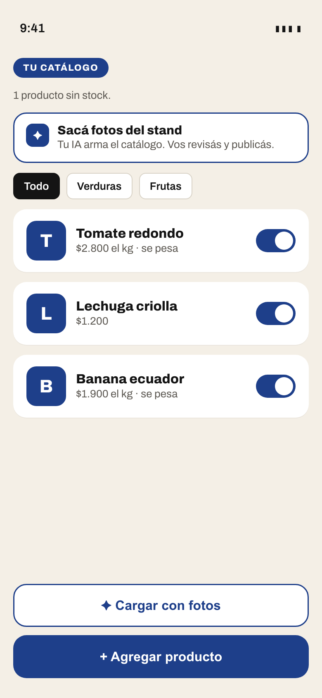

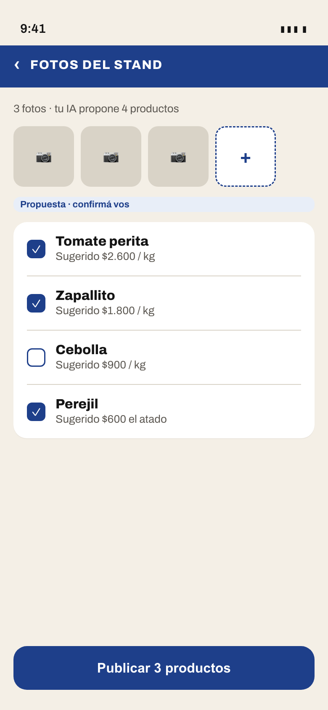

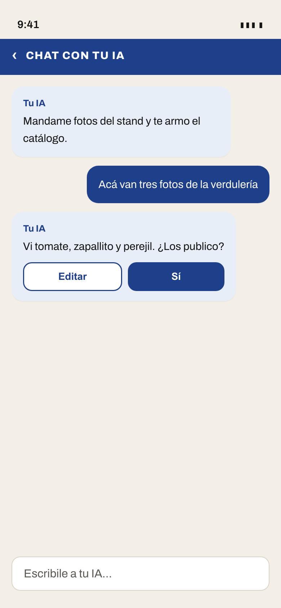

**Recomiendo A+B.** A respeta “la IA aparece donde está la tarea”. B es el paso de confirmación (sin chat genérico). C se siente pegado y empuja a charlar de más.

---

#### (b) Descripción y precio sugeridos

| Opción | Dónde | Idea |
| --- | --- | --- |
| **A — en línea** | Editar producto | Bloque “Propuesta” bajo descripción y precio (“Usar esta descripción”, chip con precio del barrio). |
| **B — hoja** | Después de sacar la foto | “¿Así te queda?” con nombre, precio y texto; Confirmar / Cambiar. |
| **C — pantalla** | “Completar con IA” | Elegís qué campos llenar y pedís propuesta. |

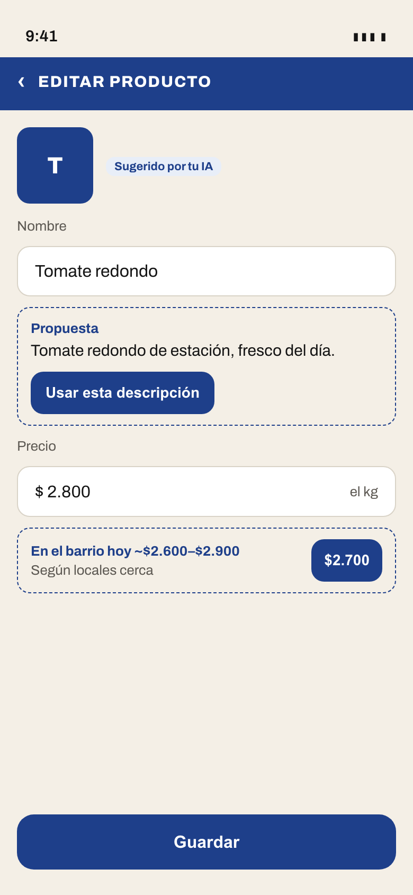

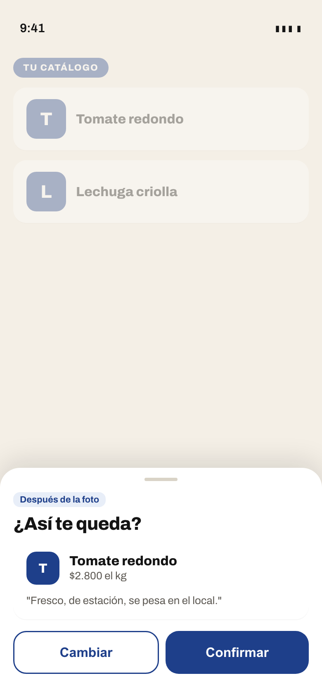

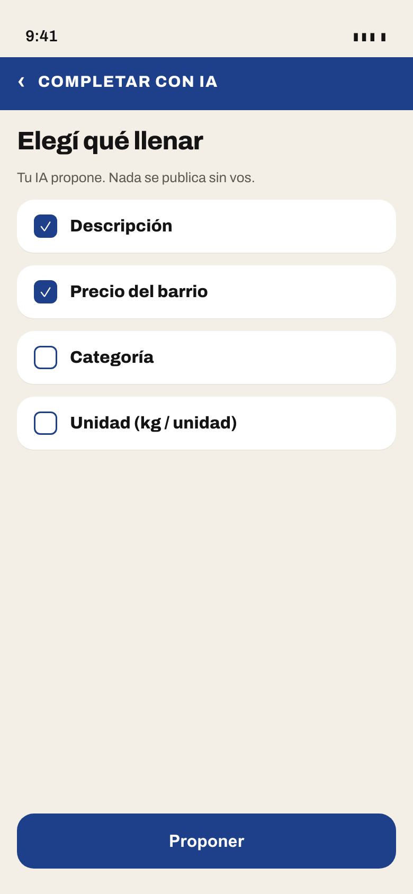

**Recomiendo A.** Es el momento en que ya estás editando. B sirve si venís de fotos. C agrega un paso de más.

---

#### (c) Responder mensajes y reseñas

Borrador que la persona confirma. Al publicar se marca como **hecho por su IA** (misma regla que el agente del comercio).

| Opción | Dónde | Idea |
| --- | --- | --- |
| **A — en línea** | Pantalla de la reseña | Borrador listo + Editar / Publicar. |
| **B — bandeja** | Bandeja / mensajes | Cada pendiente trae “Borrador listo”. |
| **C — chips** | Al escribir | “Acortar”, “Más cálido”, “Pedir disculpas”. |

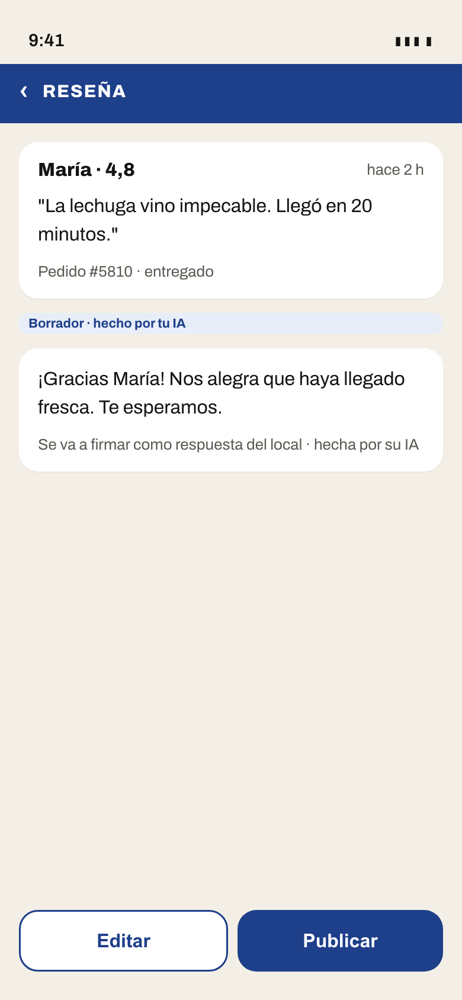

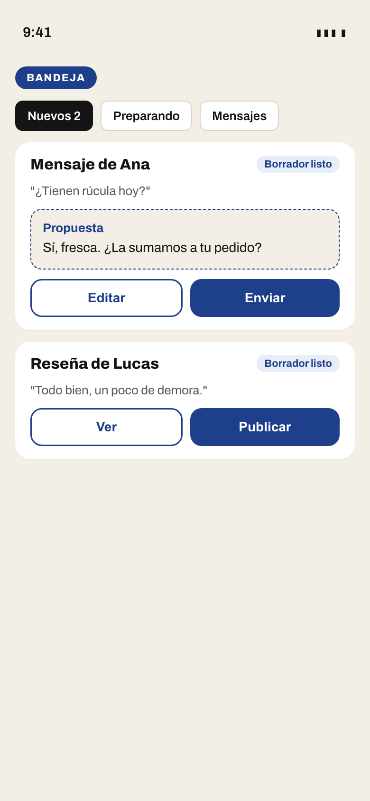

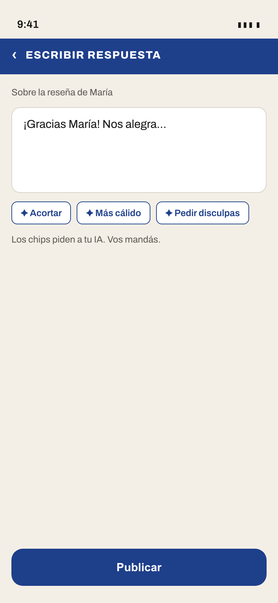

**Recomiendo A** (una reseña a la vez, claro). **B** si el local tiene muchos mensajes. C es útil como retoque, no como entrada principal.

---

#### (d) Resumen del día y qué reponer

| Opción | Dónde | Idea |
| --- | --- | --- |
| **A — en línea** | Arriba de la bandeja | “Hoy · 12 pedidos · … Se te está acabando el tomate.” |
| **B — pantalla** | “Tu día” | Números del día + lista “Qué reponer”. |
| **C — aviso** | Al cerrar | Hoja: “Cerrás en 30 min… reponer ~8 kg.” |

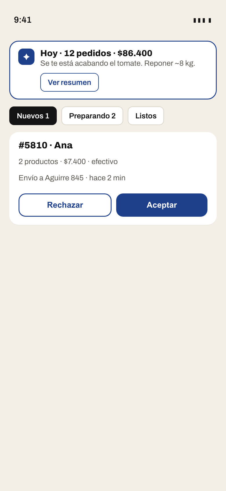

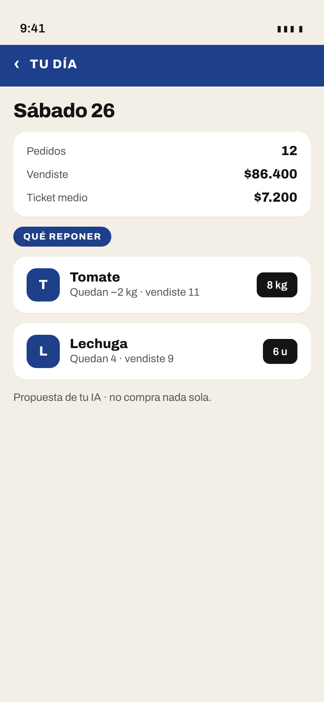

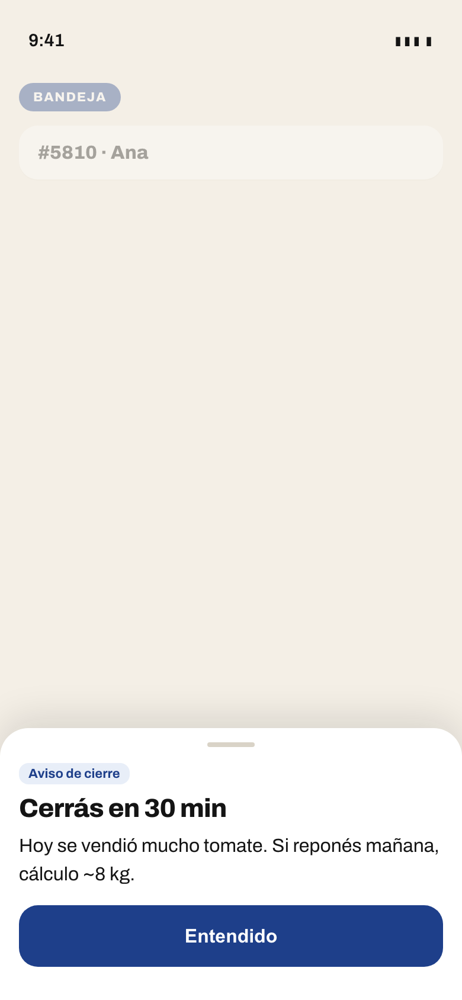

**Recomiendo A** para verlo todos los días; **B** al tocar “Ver resumen”. C solo como refuerzo, no como único lugar.

---

### Comprador

#### (e) Pedir en lenguaje natural

Ejemplo: “armame una picada para 6” → carrito propuesto → confirmás.

| Opción | Dónde | Idea |
| --- | --- | --- |
| **A — en línea** | Inicio | Campo “Armame una picada para 6…” arriba del listado. |
| **B — pantalla** | “Armame un pedido” | Texto → carrito con tildes → “Meter al carrito”. |
| **C — chat** | Asistente | Chat libre. |

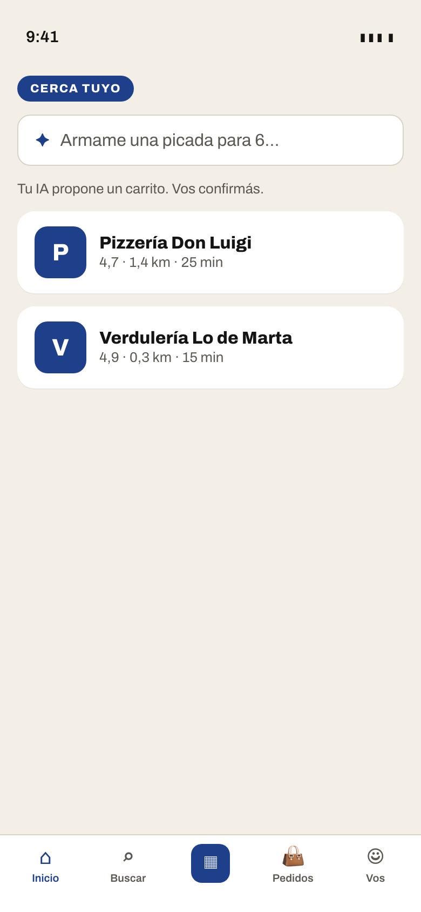

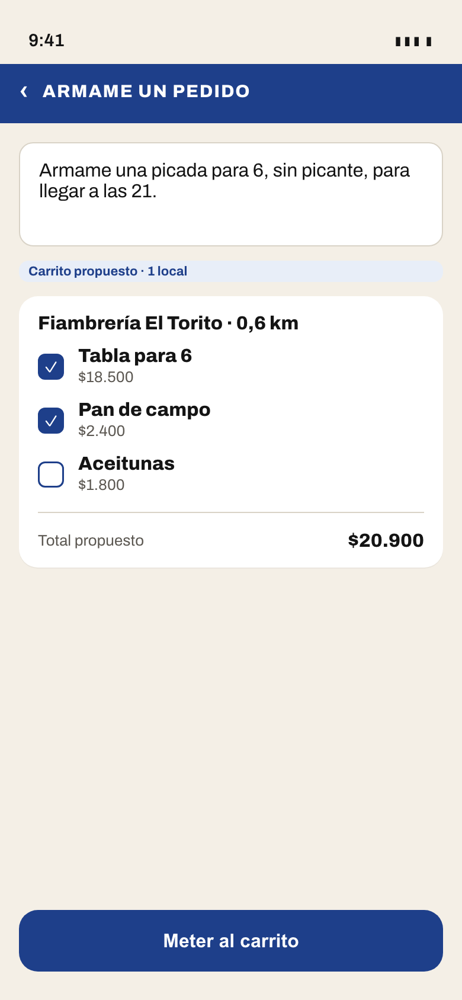

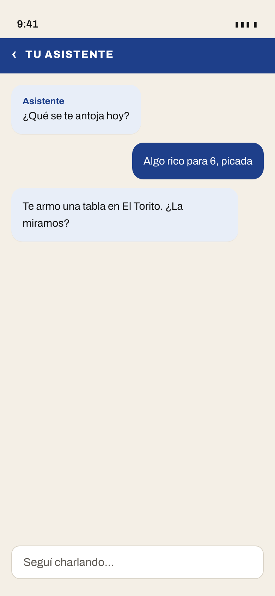

**Recomiendo A+B. No C.** El chat genérico es justo lo que no queremos.

---

#### (f) Búsqueda inteligente

| Opción | Dónde | Idea |
| --- | --- | --- |
| **A — en línea** | Buscar | “algo fresco para la cena” → entiende y filtra. |
| **B — explicación** | Resultados | Chip “Por qué” bajo el resultado. |
| **C — modo aparte** | “Búsqueda inteligente” | Pantalla separada del Buscar normal. |

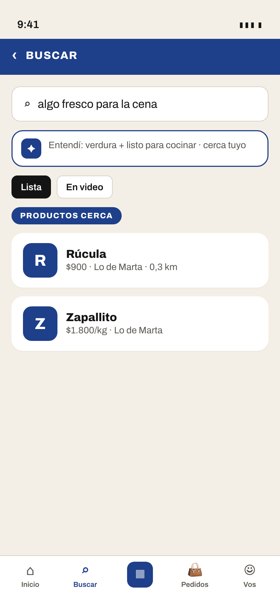

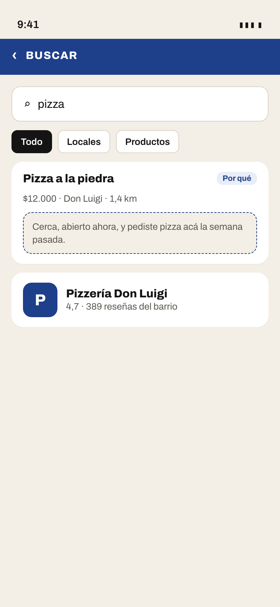

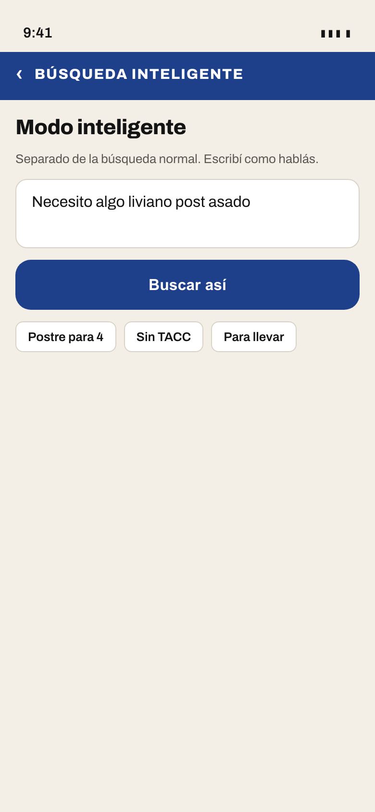

**Recomiendo A.** Una sola búsqueda. B como detalle opcional. C parte la cabeza: dos buscadores.

---

#### (g) Repetir / sugerir

| Opción | Dónde | Idea |
| --- | --- | --- |
| **A — en línea** | Inicio | “¿Lo de siempre?” + “Te puede gustar”. |
| **B — después** | Pedido entregado | Hoja: “¿La próxima?” / recordatorio. |
| **C — pantalla** | “Para vos” | Lista de sugerencias. |

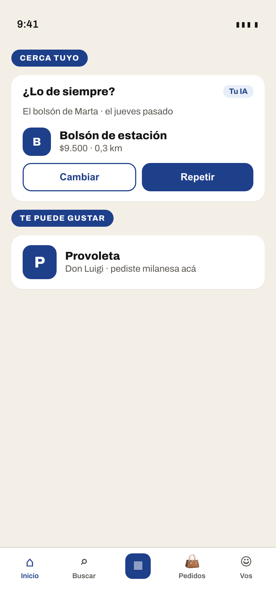

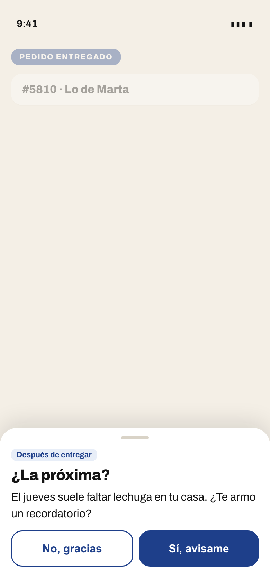

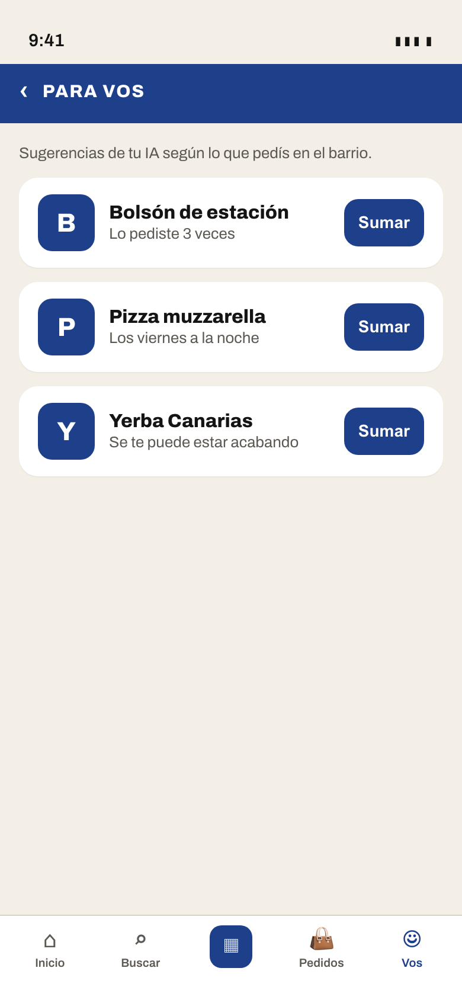

**Recomiendo A.** Está donde ya mirás el barrio. B es un buen empujón puntual. C puede esperar.

---

## 3. Pantalla “Tu IA”

Activar, ver consumo del mes, tope, y cómo se paga (transferencia al operador del barrio, como un aporte).

| Opción | Idea |
| --- | --- |
| **A — pantalla** | Prendida/apagada, consumo ≈ **USD 0,11** (≈ $170) de un tope **USD 2** (≈ $3.100), “Cómo se paga”, cambiar tope. |
| **B — hoja** | Desde Vos: resumen corto + “Activar · tope USD 2”. |
| **C — mínimo** | Solo toggle + link a conectar tu agente gratis. |

Los montos del mockup siguen §4 (comercio activo ~USD 0,09/mes): **USD 0,11 de un tope de USD 2**, no dólares enteros.

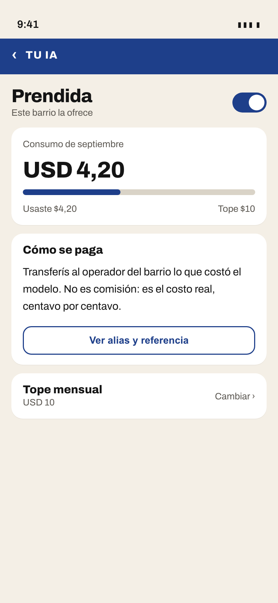

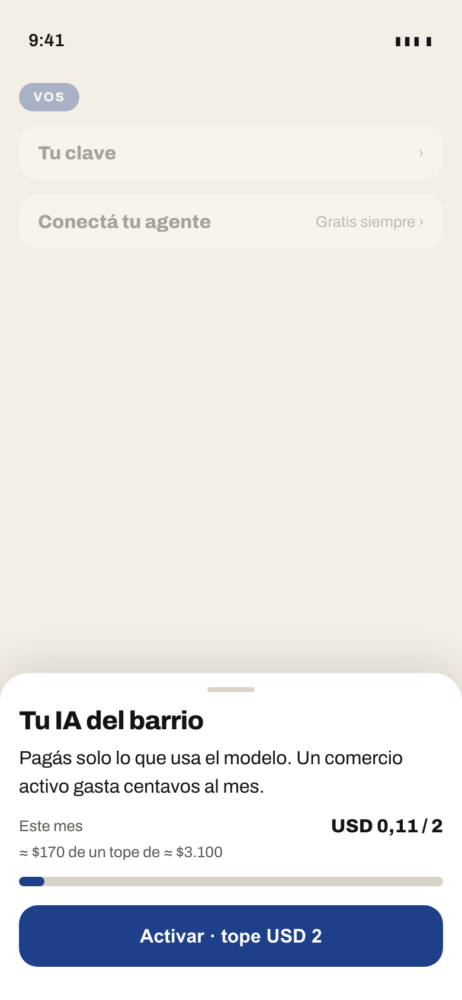

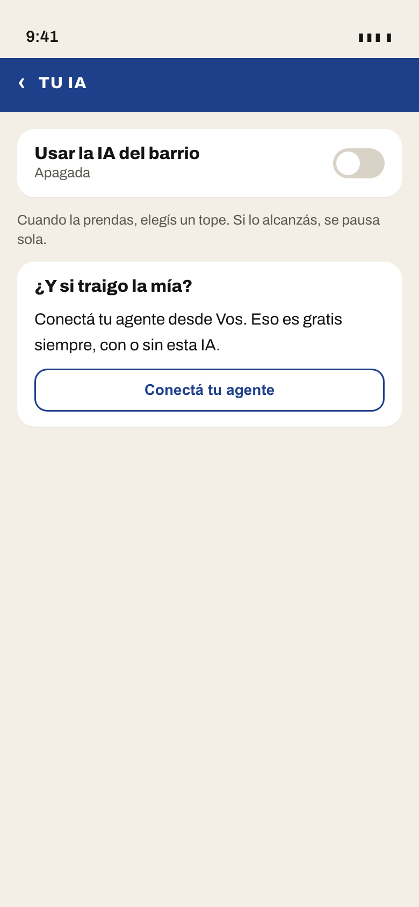

**Recomiendo A** para el piloto de 5 comercios: hay que ver que el costo es de centavos. B como atajo desde Vos. C es demasiado opaco para la primera vez.

Copy clave (para todas las opciones): *“No es comisión: es lo que cuesta el modelo.”* / *“casi gratis: pagás lo que gasta el modelo.”* Nunca digas “nodo”, “tokens” ni “API” de cara a la persona.

---

## 4. Modelos y costo estimado

Precios tomados de [OpenRouter `/api/v1/models`](https://openrouter.ai/api/v1/models) el **2026-09-26** (referencia de costo; en Vercel AI Gateway los precios de lista del proveedor son el mismo orden — ver §5; algunos ids de modelo cambian de prefijo). Tipo de cambio de referencia: dólar blue venta **ARS 1.560** (bluelytics, mismo día). El barrio cobra en USD el costo real; el equivalente en pesos es solo para leer.

### Supuestos de tokens por uso

| Función | Entrada (aprox.) | Salida (aprox.) | Notas |
| --- | --- | --- | --- |
| Catálogo desde fotos | 2.000 | 500 | Visión: ~2–3 fotos + instrucción |
| Descripción y precio | 800 | 250 | Texto + contexto del barrio |
| Responder mensaje/reseña | 600 | 200 | Reseña + tono del local |
| Resumen del día | 1.500 | 400 | Pedidos + stock del día |
| Pedir en lenguaje natural | 1.000 | 350 | Pedido + catálogo cercano |
| Búsqueda inteligente | 700 | 200 | Query + candidatos |
| Repetir / sugerir | 500 | 150 | Historial corto |

Fórmula: `costo_USD = (entrada/1e6)*precio_in + (salida/1e6)*precio_out`.

### Tabla función → modelo

| Función | Modelo recomendado | Alternativa más barata | ≈ USD / uso | ≈ ARS / uso | ≈ USD / uso (alt.) |
| --- | --- | --- | --- | --- | --- |
| Catálogo desde fotos | `google/gemini-2.5-flash` (visión) | `google/gemini-2.5-flash-lite` | 0,0019 | 2,9 | 0,0004 |
| Descripción y precio | `google/gemini-2.5-flash-lite` | `meta-llama/llama-3.3-70b-instruct` | 0,00018 | 0,28 | 0,00016 |
| Responder | `google/gemini-2.5-flash-lite` | `meta-llama/llama-3.3-70b-instruct` | 0,00014 | 0,22 | 0,00012 |
| Resumen del día | `google/gemini-2.5-flash` | `openai/gpt-4o-mini` | 0,0015 | 2,3 | 0,0005 |
| Pedir en lenguaje natural | `google/gemini-2.5-flash` | `openai/gpt-4o-mini` | 0,0012 | 1,8 | 0,0004 |
| Búsqueda | `google/gemini-2.5-flash-lite` | `meta-llama/llama-3.3-70b-instruct` | 0,00015 | 0,23 | 0,00013 |
| Repetir / sugerir | `google/gemini-2.5-flash-lite` | `meta-llama/llama-3.3-70b-instruct` | 0,00011 | 0,17 | 0,00010 |

Precios OpenRouter usados (USD / millón de tokens): Flash Lite 0,10 / 0,40 · Flash 0,30 / 2,50 · GPT-4o mini 0,15 / 0,60 · Llama 3.3 70B 0,10 / 0,32.

Si un comercio pide **más calidad de texto** (reseñas), `anthropic/claude-haiku-4.5` (1,00 / 5,00) sale ~**USD 0,0016** por respuesta (~ARS 2,5): ~10× Flash Lite, sigue siendo barato.

### Orden de magnitud mensual

Supuestos de volumen:

- **Comercio activo:** 20 cargas de fotos, 60 descripciones, 40 respuestas, 25 resúmenes/mes.
- **Comprador ocasional:** 8 pedidos en lenguaje natural, 20 búsquedas, 10 sugerencias/mes.

| Perfil | ≈ USD / mes | ≈ ARS / mes |
| --- | ---: | ---: |
| Comercio activo (modelos recomendados) | **0,09** | **~140** |
| Comprador ocasional | **0,014** | **~20** |

Con Haiku en todas las respuestas del comercio y Flash en el resto, un comercio activo ronda **USD 0,15–0,40 / mes**. El número grande de “USD 3–15” del memo premium-ai asumía modelos clase Sonnet por turno; con Flash/Flash Lite el costo real del piloto es **centavos**. Conviene decirlo así en el copy: *“casi gratis: pagás lo que gasta el modelo”*.

Visión para fotos: `gemini-2.5-flash` (recomendado) o `gemini-2.5-flash-lite` / `qwen/qwen3-vl-30b-a3b-instruct` (0,15 / 0,60) si hace falta recortar más.

---

## 5. OpenRouter vs Vercel AI Gateway

El operador del barrio elige el gateway por config (`openrouter` | `vercel`). El nodo trae **dos adaptadores desde el día uno**; ninguno hardcodeado. Fuentes leídas el **2026-09-26**: [Vercel AI Gateway](https://vercel.com/docs/ai-gateway), [pricing](https://vercel.com/docs/ai-gateway/pricing), [budgets](https://vercel.com/docs/ai-gateway/observability-and-spend/budgets), [usage/generation lookup](https://vercel.com/docs/ai-gateway/observability-and-spend/usage), [OpenRouter docs](https://openrouter.ai/docs) ([API keys](https://openrouter.ai/docs/api-keys), [FAQ / fees](https://openrouter.ai/docs/faq), [create keys](https://openrouter.ai/docs/api/api-reference/api-keys/create-keys), [get generation](https://openrouter.ai/docs/api/api-reference/generations/get-generation)), [Vercel for Startups credits](https://vercel.com/startups/credits).

### Comparación

| | **OpenRouter** | **Vercel AI Gateway** |
| --- | --- | --- |
| **Costo / markup sobre el proveedor** | Sin markup en la inferencia: pasa el precio de lista del proveedor. Al **comprar créditos** cobra **5,5% (mín. USD 0,80)** con tarjeta (Stripe); cripto **5%**. BYOK: sin fee hasta USD 25.000/mes de costo de lista (PAYG); arriba de eso, **5%** del costo OpenRouter equivalente. | Sin markup ni fee de plataforma sobre tokens: precio de lista del proveedor, también con BYOK. Tier free: **USD 5/mes** de créditos incluidos (subset de modelos + rate limits más bajos). Tier pago: comprás créditos. Pueden aplicar **fees de procesamiento de pago** (tarjeta); factura Enterprise = sin esos fees. Add-ons opcionales (reporting, allowlist/ZDR team-wide, traces) se cobran aparte. |
| **Topes por cuenta (sub-claves)** | **Sí, nativo.** Management API `POST /api/v1/keys` con `limit` (USD) y `limit_reset` (`daily` \| `weekly` \| `monthly` \| sin reset). Ideal para una sub-clave por identidad con tope mensual. | **Budgets** opcionales por team / project / **API key** / member, con refresh daily/weekly/monthly. Sin budget = spend ilimitado en esa clave. **No** hay provisioning de sub-claves con tope tan directo como OpenRouter: el nodo tiene que crear claves + budgets (o imponer el tope él mismo). |
| **Costo real por llamada** | `GET /api/v1/generation/{id}` → `total_cost`, `upstream_inference_cost`, tokens nativos. El `id` viene en la respuesta de chat. | `GET /v1/generation?id=…` (o SDK `gateway.getGenerationInfo`) → costo con desglose (`market_cost`, `surcharge_cost`, `gateway_cost`), tokens, latencia. El `id` viene en la respuesta (`id` / `providerMetadata.gateway.generationId`). Logs en el dashboard. |
| **Modelos de la tabla §4** | Todos con los ids de OpenRouter (catálogo `/api/v1/models`). | Verificados el 2026-09-26 en `https://ai-gateway.vercel.sh/v1/models`: `google/gemini-2.5-flash`, `google/gemini-2.5-flash-lite`, `openai/gpt-4o-mini`, `anthropic/claude-haiku-4.5` **sí**. Llama: `meta/llama-3.3-70b` (id distinto a `meta-llama/llama-3.3-70b-instruct`). Visión Qwen: familia `alibaba/qwen3-vl-…` (no el id exacto `qwen/qwen3-vl-30b-a3b-instruct`). El adaptador mapea ids por gateway. |
| **Créditos / programa startups** | No hay programa de financiamiento equivalente documentado; cargás créditos. | **Vercel for Startups**: hasta **USD 30.000** de Flexible Commitment (asientos, compute, **AI Gateway**, v0, etc.) por 1 año o hasta agotar. **Tope AI Gateway: 50%** del commitment (el resto no se puede volcar todo a IA). Elegibilidad: afiliación a un **Startup Partner** aprobado + prueba; Series A o menos; aplicar dentro de los 12 meses de la última ronda; web + email del dominio; sin créditos startups previos. Aplicación: [vercel.com/startups/credits](https://vercel.com/startups/credits) (formulario + team + partner + proof). Review ~5–7 días; al aceptar términos, créditos en ~5–7 días hábiles. Términos Flex Commit p/ aceptados desde **2026-08-06**. Sin partner en la lista: pedir al VC el [partner request](https://vercel.com/startups/partners) — Vereda bootstrapeada puede no calificar tal cual. |

### Recomendación (default)

**Arrancar con OpenRouter por defecto:** sub-claves con tope mensual nativas (encajan con “cada cuenta elige su tope”), lectura de costo por generación clara, sin depender de partner/créditos. **Vercel como segundo adaptador desde el día uno** — conviene prenderlo si Leo consigue el programa startups (hasta ~USD 15.000 útiles para AI Gateway vía el 50%) o si el operador del barrio ya opera en Vercel.

---

## 6. Qué llega el lunes 28 y qué no

| Llega el lunes | No llega el lunes |
| --- | --- |
| Spec de la capacidad `ia` (otro worker: `docs/ia/capacidad.md` / `docs/ia.md`) | Pantallas de comercio o comprador |
| Adaptadores del nodo **OpenRouter y Vercel AI Gateway**, elegidos por config, **apagados por defecto** | Deploy a prod del nodo con IA prendida |
| Sin clave / sin toggle → el nodo se comporta como hoy | Build de tiendas (App Store / Play) con IA |
| | Piloto con 5 comercios (después del OK de pantallas) |
| | Créditos Vercel for Startups (Leo aplica aparte si califica) |

Las pantallas de este documento se construyen **después** de que elijas A/B/C (y el gateway default del §0.9), apuntando a una **1.1**. El lanzamiento del 28 no se toca: mergeado y apagado, sin entrar al deploy ni a los builds de tienda.

---

## Cómo leer esto en el teléfono

1. Mirá la lista del §0 y marcá A/B/C (incluida la 9 del gateway).
2. Si dudás de pantallas, abrí el PNG de la opción.
3. Los números del §4 son de referencia; el extracto real va a mostrar el costo centavo por centavo.
4. Si te importa el financiamiento Vercel, leé el §5 antes de elegir gateway.
